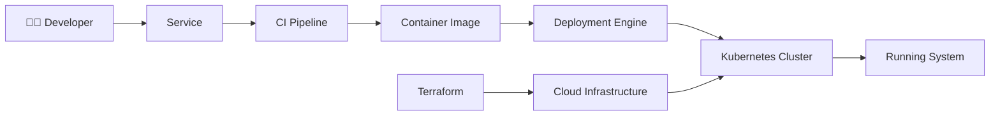

# 🚀 Microservice Platform

<p align="center">
  <b>Build. Ship. Operate.</b><br/>
  A production-grade platform for developing, validating, and deploying microservices at scale.
</p>

<p align="center">
  <i>Opinionated. Reproducible. Designed for real systems.</i>
</p>

---

## 🧭 The Problem

Modern microservices fail for predictable reasons:

* inconsistent service structure
* fragile CI/CD pipelines
* hidden deployment risks
* environment drift
* Kubernetes misconfigurations

Each team solves this differently — and repeatedly.

---

## 💡 The Approach

This platform enforces a **single, reliable path**:

> **Code → Test → Secure → Package → Deploy → Operate**

Everything else is eliminated.

---

## ⚡ What This Platform Provides

* 🔁 **Standardized service lifecycle**
* ⚙️ **Deterministic CI/CD pipelines**
* 🐳 **Reproducible container builds**
* ☸️ **Kubernetes-native deployment engine**
* 🔒 **Security-first workflows**
* 🌍 **Infrastructure as code (Terraform)**

---

## 🧠 System Architecture



---

## 🏁 Getting Started (Fast Path)

Run a full service lifecycle in minutes:

```bash
ci/test.sh auth-service
REGISTRY=local ci/build.sh auth-service dev
deploy/k8s/deploy.sh auth-service
```

---

## 🧪 Platform Validation

`auth-service` is the primary service for validating the platform.

It proves:

* CI works
* builds are reproducible
* deployments are valid
* runtime behavior is correct

| Endpoint  | Purpose        |
| --------- | -------------- |
| `/`       | Basic response |
| `/health` | Liveness       |
| `/ready`  | Readiness      |

Services currently in the repository:

| Service | Language | Status |
|---------|----------|--------|
| auth-service | Node.js | Active |
| platform-smoke-test | Node.js | Active |
| orders-service | - | Coming soon |
| payments-service | - | Coming soon |

---

## 🏗️ Repository Design

```text
services/           # Deployable services
templates/          # Service blueprints
ci/                 # Build/test/security pipelines
.github/workflows/  # Automation layer
deploy/k8s/         # Deployment engine
deploy/providers/   # Environment adapters
environments/       # Configuration
terraform/          # Infrastructure
```

---

## 🛠️ Service Contract

Every service must conform to:

```text
services/<service>/
  Dockerfile
  service.yml
  src/
```

Example:

```yaml
name: service-name
language: node

docker:
  port: 3000

deploy:
  healthcheck: /health
  readiness: /ready
```

This contract ensures:

* predictable CI behavior
* consistent deployment
* stable runtime checks

---

## ☸️ Deployment Model

The platform uses:

* **Kustomize** → composition
* **Environment variables** → configuration
* **Scripts** → execution

### Configure

```bash
IMAGE_REGISTRY=local
IMAGE_TAG=dev
K8S_NAMESPACE=dev
SERVICE_PORT=80
CONTAINER_PORT=3000
```

### Deploy

```bash
deploy/k8s/deploy.sh auth-service
```

---

## 🔍 Pre-Deployment Validation

Render manifests without a cluster:

```bash
RENDER_ONLY=true \
RENDER_OUTPUT_DIR=build/rendered/auth-service \
deploy/k8s/deploy.sh auth-service

kubectl kustomize build/rendered/auth-service
```

---

## 🌐 Runtime Verification

```bash
kubectl port-forward svc/auth-service 8080:80

curl http://localhost:8080/
curl http://localhost:8080/health
curl http://localhost:8080/ready
```

---

## 🔒 Security Model

Security is built into the platform:

* no secrets in code
* image scanning in CI
* network isolation via NetworkPolicy
* least-privilege defaults

---

## 🧯 Failure Modes

| Failure         | Cause               | Resolution             |
| --------------- | ------------------- | ---------------------- |
| Build fails     | Docker unavailable  | Start Docker           |
| Deploy fails    | Cluster unreachable | Check kubeconfig       |
| Pod crash       | Probe mismatch      | Fix endpoints          |
| No traffic      | Selector mismatch   | Align labels           |
| No scaling      | Missing metrics     | Install metrics-server |
| Network blocked | Policy rules        | Adjust NetworkPolicy   |

---

## 🧠 Design Principles

This platform is intentionally opinionated:

* **Consistency > flexibility**
* **Automation > manual intervention**
* **Security > convenience**
* **Explicit > implicit**

---

## 📈 What This Enables

With this platform:

* services behave predictably
* deployments are reproducible
* failures are diagnosable
* systems scale safely

---

## 🤝 Contribution Model

Changes should:

* preserve platform consistency
* avoid breaking templates
* maintain reproducibility

---

## 📄 License

MIT

---

## ⭐ Final Statement

This is not a collection of tools.

> It is a **system for building reliable distributed services**
